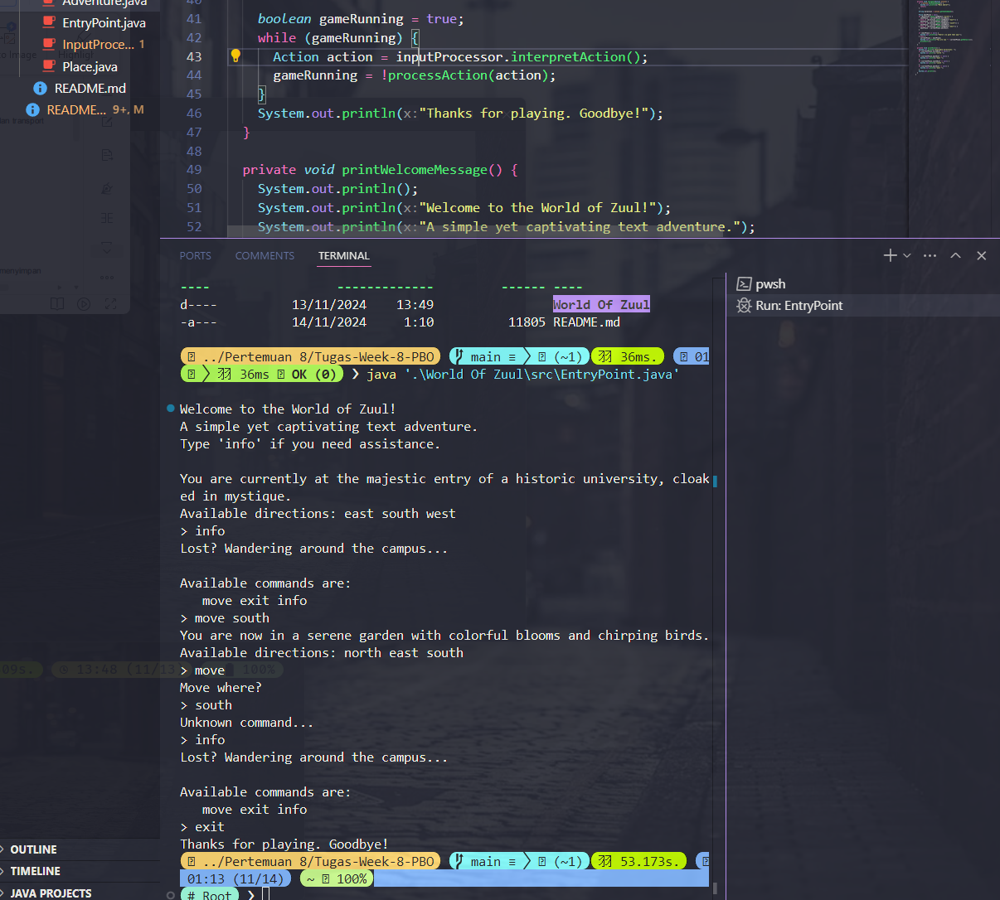

# **Tugas PBO Week 8**

**Nama** : Adyuta Prajahita Murdianto

**NRP** : 5025221186

**Kelas** : PBO A

# **Kelas EntryPoint**

```java
public class EntryPoint {
  public static void main(String[] args) {
    Adventure adventureGame = new Adventure();
    adventureGame.startGame();
  }
}
```

Kelas utama yang menjadi titik masuk (entry point) untuk menjalankan permainan.

# **Kelas Adventure**

```java
public class Adventure {
  private InputProcessor inputProcessor;
  private Place currentPlace;

  public Adventure() {
    setupPlaces();
    inputProcessor = new InputProcessor();
  }

  private void setupPlaces() {
    Place entry, hall, bar, lab, directorRoom, library, hiddenRoom, garden, dining, roof;

    entry = new Place("at the majestic entry of a historic university, cloaked in mystique.");
    hall = new Place("inside a grand lecture hall with dust-covered chalkboards and dim lights.");
    bar = new Place("in a charming bar on campus with a jazzy ambiance.");
    lab = new Place("in a state-of-the-art computer lab filled with blinking screens.");
    directorRoom = new Place("in the cluttered office of the head professor, lined with old books.");
    library = new Place("in an expansive library with countless shelves of ancient books.");
    hiddenRoom = new Place("in a secret room beneath the library, with glowing crystals and strange symbols.");
    garden = new Place("in a serene garden with colorful blooms and chirping birds.");
    dining = new Place("in the lively cafeteria filled with the scent of fresh coffee.");
    roof = new Place("on the university rooftop, offering a star-lit view of the campus.");

    entry.defineExits(null, hall, garden, bar);
    hall.defineExits(null, null, null, entry);
    bar.defineExits(null, entry, null, null);
    garden.defineExits(entry, library, dining, null);
    dining.defineExits(garden, null, null, null);
    lab.defineExits(directorRoom, roof, null, null);
    directorRoom.defineExits(null, lab, null, null);
    library.defineExits(null, hiddenRoom, null, garden);
    hiddenRoom.defineExits(null, null, library, null);
    roof.defineExits(null, null, null, lab);

    currentPlace = entry;
  }

  public void startGame() {
    printWelcomeMessage();

    boolean gameRunning = true;
    while (gameRunning) {
      Action action = inputProcessor.interpretAction();
      gameRunning = !processAction(action);
    }
    System.out.println("Thanks for playing. Goodbye!");
  }

  private void printWelcomeMessage() {
    System.out.println();
    System.out.println("Welcome to the World of Zuul!");
    System.out.println("A simple yet captivating text adventure.");
    System.out.println("Type 'info' if you need assistance.");
    System.out.println();
    System.out.println("You are currently " + currentPlace.getDetails());

    printExits();
  }

  private boolean processAction(Action action) {
    boolean exitGame = false;

    if (action.isUndefined()) {
      System.out.println("Unknown command...");
      return false;
    }

    String actionName = action.getMainCommand();
    if (actionName.equals("info")) {
      printHelp();
    } else if (actionName.equals("move")) {
      navigate(action);
    } else if (actionName.equals("exit")) {
      exitGame = true;
    }

    return exitGame;
  }

  private void printHelp() {
    System.out.println("Lost? Wandering around the campus...");
    System.out.println();
    System.out.println("Available commands are:");
    System.out.println("   move exit info");
  }

  private void navigate(Action action) {
    if (!action.hasSubCommand()) {
      System.out.println("Move where?");
      return;
    }

    String direction = action.getSubCommand();

    Place nextPlace = null;
    if (direction.equals("north")) {
      nextPlace = currentPlace.northExit;
    } else if (direction.equals("east")) {
      nextPlace = currentPlace.eastExit;
    } else if (direction.equals("south")) {
      nextPlace = currentPlace.southExit;
    } else if (direction.equals("west")) {
      nextPlace = currentPlace.westExit;
    }

    if (nextPlace == null) {
      System.out.println("There's no path that way!");
    } else {
      currentPlace = nextPlace;
      System.out.println("You are now " + currentPlace.getDetails());
      printExits();
    }
  }

  private void printExits() {
    System.out.print("Available directions: ");
    if (currentPlace.northExit != null) {
      System.out.print("north ");
    }
    if (currentPlace.eastExit != null) {
      System.out.print("east ");
    }
    if (currentPlace.southExit != null) {
      System.out.print("south ");
    }
    if (currentPlace.westExit != null) {
      System.out.print("west ");
    }
    System.out.println();
  }
}
```

## **Attribute**

**inputProcessor**

Objek yang digunakan untuk membaca input pengguna dan menginterpretasikan input menjadi perintah yang dapat diproses.

**currentPlace**

Menyimpan lokasi (tempat) di mana pemain berada saat ini dalam permainan. Ini memungkinkan program melacak posisi pemain dan menampilkan deskripsi serta arah yang tersedia.

## **Method**

**Adventure**

Konstruktor yang menginisialisasi permainan dengan memanggil metode setupPlaces() untuk membuat peta lokasi dan mengatur inputProcessor.

**setupPlaces**

Metode ini bertanggung jawab untuk membuat semua tempat dalam permainan dan mendefinisikan arah keluar (exits) yang tersedia dari setiap tempat. Lokasi seperti entry, hall, bar, dan lain-lain dibuat dan dihubungkan satu sama lain.

**startGame**

Metode ini menjalankan loop utama permainan. Loop ini terus berjalan sampai pengguna mengetik perintah exit. Setiap input pengguna diinterpretasikan menjadi Action oleh inputProcessor, dan kemudian diproses oleh metode processAction().

**printWelcomeMessage**

Menampilkan pesan selamat datang kepada pemain, memberikan deskripsi tempat saat ini, dan menampilkan arah yang dapat diakses.

**processAction**

Metode ini menerima objek Action sebagai parameter dan memproses perintah yang diberikan pengguna. Metode ini mengembalikan true jika perintah exit ditemukan, yang menghentikan loop permainan.

**printHelp**

Menampilkan pesan bantuan kepada pemain, mencantumkan perintah-perintah yang valid seperti move, exit, dan info.

**navigate**

Mengatur navigasi pemain ke lokasi baru berdasarkan sub-perintah (arah) dari objek Action. Jika sub-perintah kosong, metode ini akan meminta pemain untuk memasukkan arah.

**printExits**

Menampilkan semua arah yang dapat diakses dari tempat saat ini. Metode ini memeriksa apakah arah north, south, east, atau west tersedia dan menampilkannya kepada pemain.

# **Kelas InputProcessor**

```java
import java.util.Scanner;

public class InputProcessor {
  private ActionList actions;
  private Scanner scanner;

  public InputProcessor() {
    actions = new ActionList();
    scanner = new Scanner(System.in);
  }

  public Action interpretAction() {
    String userInput;
    String primaryCommand = null;
    String secondaryCommand = null;

    System.out.print("> ");

    userInput = scanner.nextLine();

    Scanner tokenizer = new Scanner(userInput);
    if (tokenizer.hasNext()) {
      primaryCommand = tokenizer.next();
      if (tokenizer.hasNext()) {
        secondaryCommand = tokenizer.next();
      }
    }

    if (actions.isValidAction(primaryCommand)) {
      return new Action(primaryCommand, secondaryCommand);
    } else {
      return new Action(null, secondaryCommand);
    }
  }
}
```

## **Attribute**

**actions**

Objek yang menyimpan daftar perintah valid. Digunakan untuk memvalidasi apakah perintah yang dimasukkan pengguna dikenal oleh sistem.

**scanner**

Objek Scanner digunakan untuk membaca input dari pengguna di terminal.

## **Method**

**InputProcessor**

Konstruktor yang menginisialisasi objek ActionList dan Scanner.

**interpretAction**

Membaca input pengguna menggunakan scanner dan memecahnya menjadi perintah utama (mainCommand) dan perintah sekunder (subCommand). Jika perintah utama valid, metode ini mengembalikan objek Action yang sesuai. Jika tidak, perintah utama disetel ke null untuk menandakan bahwa perintah tidak valid.

# **Kelas Action**

```java
public class Action {
  private String mainCommand;
  private String subCommand;

  public Action(String mainCommand, String subCommand) {
    this.mainCommand = mainCommand;
    this.subCommand = subCommand;
  }

  public String getMainCommand() {
    return mainCommand;
  }

  public String getSubCommand() {
    return subCommand;
  }

  public boolean isUndefined() {
    return (mainCommand == null);
  }

  public boolean hasSubCommand() {
    return (subCommand != null);
  }
}
```

## **Attribute**

**mainCommand**

Perintah utama yang dimasukkan pengguna, seperti move, exit, atau info.

**subCommand**

Perintah sekunder yang dapat berupa arah seperti north, south, east, atau west.

## **Method**

**Action**

Konstruktor yang menginisialisasi mainCommand dan subCommand.

**getMainCommand**

Mengembalikan perintah utama (mainCommand).

**isUndefined**

Mengembalikan perintah sekunder (subCommand).

**hasSubCommand**

Mengecek apakah mainCommand tidak didefinisikan (bernilai null), yang menandakan bahwa perintah tidak valid.

**hasSubCommand**

Mengecek apakah subCommand ada (tidak null), yang menandakan bahwa pengguna telah memberikan perintah sekunder.

# **Kelas ActionList**

```java
public class ActionList {
  private static final String[] validActions = {
      "move", "exit", "info"
  };

  public ActionList() {
  }

  public boolean isValidAction(String action) {
    for (String validAction : validActions) {
      if (validAction.equals(action)) {
        return true;
      }
    }
    return false;
  }
}
```

## **Attribute**

**validActions**

Array statis berisi daftar perintah valid, seperti move, exit, dan info.

## **Method**

**ActionList**

Konstruktor kosong yang menginisialisasi validActions.

**isValidAction**

Mengecek apakah perintah yang diberikan (action) terdapat dalam validActions. Mengembalikan true jika perintah valid, false jika tidak.

# **Kelas Place**

```java
public class Place {
  private String details;
  public Place northExit;
  public Place southExit;
  public Place eastExit;
  public Place westExit;

  public Place(String details) {
    this.details = details;
  }

  public void defineExits(Place north, Place east, Place south, Place west) {
    if (north != null) {
      northExit = north;
    }
    if (east != null) {
      eastExit = east;
    }
    if (south != null) {
      southExit = south;
    }
    if (west != null) {
      westExit = west;
    }
  }

  public String getDetails() {
    return details;
  }
}
```

## **Attribute**

**details**

Deskripsi singkat tentang tempat tersebut, digunakan untuk memberi tahu pemain di mana mereka berada.

**northExit, southExit, eastExit, westExit**

Referensi ke tempat lain yang dapat diakses dari tempat saat ini. Setiap atribut ini menyimpan referensi ke objek Place lain.

## **Method**

**Place**

Konstruktor yang menginisialisasi details dengan deskripsi tempat.

**defineExits**

Menentukan tempat-tempat yang dapat diakses dari arah tertentu. Setiap parameter dapat berupa referensi ke objek Place lain atau null jika tidak ada jalan di arah tersebut.

**getDetails**

Mengembalikan deskripsi details tempat untuk ditampilkan kepada pemain.

## **Hasil**

